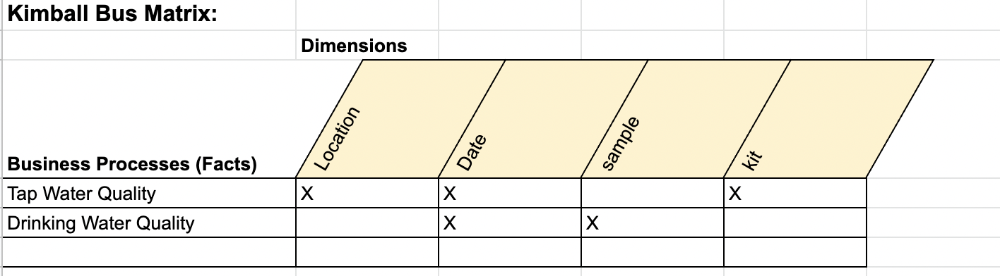

# New York City Water Quality Inspection Data Warehouse Project 
- date created: 24 Feb 2022

Project Objective: Follow the Kimball Lifecycle to design and develop a public, cloud-based Data Warehouse with functioning BI Applications

Project Tools:
The tools used to build this Data Warehouse were: 
1. For data integration - python
2. For data warehousing - Google BigQuery
3. For Business Intelligence - Tableau

## Kimball Lifecycle Project Stages

### Project Planning

#### Motivation for project:

Water is the source of human life, it is indispensable to our daily life.   
Therefore, understanding the quality of water is crucial for human beings.  

#### Description of the issues or opportunities the project will address:
Water is a significant resource for human beings, and the quality of water is crucial to people’s health. 
The polluted water may contain contaminants that’s harmful to human health and spread diseases, such as E. coli, Salmonella, cryptosporidium, etc. 
The quality inspection of water is closely related to all of us. The quality of drinking water varies from place to place. 
What is the quality of drinking water in New York City? Has drinking water been abnormal for years? Does New York need more wastewater treatment plants?
To answer these questions, New York City Water Quality Inspection Data Warehouse will combine the turbidity, chlorination, coliform detection, drinking water tank detection results and wastewater treatment.


#### Project Business or Organization Value:
With a clear water quality test report, people can determine whether the quality of drinking water needs to be optimized or not. 
Water resources are closely related to human economic and social development. 
According to the WHO article, improving water resources can reduce the time and energy that people spend and increase productivity in other tasks rather than getting water. 
Also, children are more vulnerable to water-related diseases, so improved water management can reduce health threats and improve school attendance rates (“Drinking-Water.” ). 
Data warehousing allows us to develop strategies for improving water infrastructure. Optimizing water infrastructure can help society reduce health care costs and save time for greater productivity. 
The detection and optimization of water quality and the optimization strategy of water infrastructure will bring sustainable development to the society, the economy, and the environment.

“Drinking-Water.” World Health Organization, World Health Organization, 14 June 2019, https://www.who.int/news-room/fact-sheets/detail/drinking-water.

#### Data Sources:
Dataset 1: Drinking Water Quality Distribution Monitoring Data	
Dataset 2: Free Residential at the tap Lead and Copper Data


### Business Requirements Definition

List of Data Warehouse KPI's:

1.	Average Copper Concentration in tap water by Location
2.	Average Lead Concentration in tap water by Location
3.	Average Free Chlorine of drinking water by Year
4.	Average E. coli of drinking water by Year
5.	Average Turbidity of Drinking Water by Year


### Dimensional Model

This project's Dimensional Model consists of (x) Facts and (y) Dimensions


This project's Kimball Bus Matrix:



### Business Intelligence Design and Development

List of Visualizations for each KPI:

1. Average Copper Concentration in tap water by Location 

For this KPI, I decided to use the visualization of a Geography Map because this KPI analyzes the average copper concentration in tap water in different locations. 
I think a Geography Map can be used more effectively to show which regions may need to pay more attention to the average copper concentration in tap water.

2. Average Lead Concentration in tap water by Location 

Like the previous KPI, this KPI is also about tap water quality in different regions. 
This KPI analyzes the average lead concentration in tap water in different locations. 
Therefore, I think a Geography Map can be used more effectively to show which region may need more attention to the average lead concentration in tap water.

3. Average Free Chlorine of drinking water by Year 

This KPI analyzed the change of average free chlorine in drinking water during different periods. 
I think it is more appropriate to use a Line Chart to show this KPI because I can see the change in free chlorine in drinking water this year and know whether the quality of drinking water is stable.

4. Average E. coli in drinking water by Year 

Since the average E. coli is a very small number, I decided to use the Packed Bubble Chart. 
This made me see more clearly which year’s average E. coli was the highest. 
I can know whether the drinking water quality needs to be improved this year by the size and color of the bubble.

5. Average Turbidity of Drinking Water by Year

I want to use a Bar Chart to represent this KPI because I want to compare the drinking water quality and understand the average turbidity of drinking water in recent years. 
At the same time, I want to sort out the average turbidity in recent years to see which year had the highest average turbidity and whether the drinking water quality was stable this year.


### Deployment

The project was deployed on Tableau Public:   

Tap Water Quality Dashboard:  
https://public.tableau.com/app/profile/a1930/viz/WaterQualityProject-TapWater/Dashboard2

Drinking Water Quality Dashboard:  
https://public.tableau.com/app/profile/a1930/viz/WaterQualityProject/Dashboard3


```python

```
